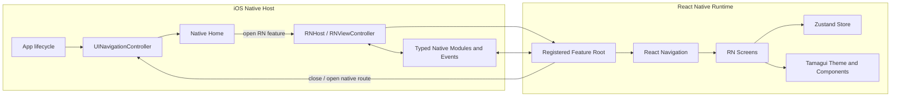

# Ody App 初始化与混合架构计划

> 状态：Draft / 待评审  
> 日期：2026-08-13  
> 本阶段范围：只确认方案与实施计划，不初始化工程代码。

## 1. 背景与目标

从空仓库初始化一个 **iOS 优先** 的 App。App 采用 React Native（以下简称 RN）承载可跨端演进的业务页面，同时保留原生开发能力；第一阶段首页由 iOS Native 实现，Android 暂不创建、不构建、不验收。

目标：

- 建立可运行、可测试、可持续升级的 RN + iOS Native 基础工程。
- 明确 Native 与 RN 的页面、导航、状态和通信边界。
- 提供状态管理、路由、主题化 UI 基础设施。
- 首个闭环为：Native 首页进入 RN 示例流程，RN 可返回 Native 首页。
- 依赖版本锁定并可复现安装，CI 至少验证 TypeScript、Lint、测试和 iOS 构建。

非目标：

- 第一阶段不适配、不构建 Android。
- 不在初始化阶段引入动态化/热更新平台。
- 不提前建设复杂业务中台、微前端框架或通用插件市场。
- 不让 RN 路由直接控制 Native 导航栈。

## 2. 推荐结论

采用 **Native-first brownfield（原生壳 + RN 业务模块）**：

- iOS：Swift + UIKit，拥有 App 生命周期、启动流程、根导航和 Native 首页。
- RN：TypeScript，按业务模块注册 Root Component，由 Native 按需挂载。
- 跨边界导航：Native `UINavigationController` 是唯一总导航；RN 内部页面使用 React Navigation。
- 客户端状态：Zustand；异步服务端状态在真正接 API 时引入 TanStack Query，两者不混用职责。
- UI：Tamagui 作为候选首选，以 design tokens/theme 为定制入口；在 PoC 阶段验证包体、启动性能和原生嵌入表现后正式锁定。
- 样式系统：首期不叠加 NativeWind；Tamagui 与 NativeWind 作为二选一的 PoC 候选，而不是同时作为全局样式入口。
- JS 包管理：pnpm；Node 版本通过 `.nvmrc`/Volta 二选一固定（实施时根据团队环境决定）。
- RN 使用当时稳定版本的精确版本号，并与 Xcode、iOS Deployment Target、CocoaPods/Ruby 工具链一起形成兼容矩阵；不使用 `latest` 或宽松版本范围。

选择 Native-first 而不是 RN-first，是因为首页仍为 Native，且 Native 需要长期拥有应用级导航和生命周期。这样不会为了短期初始化方便而形成“RN 是壳、Native 首页反向嵌入”的双重所有权。

## 3. 方案比较

| 方案 | 描述 | 优点 | 代价/风险 | 结论 |
| --- | --- | --- | --- | --- |
| A. Native-first brownfield | Swift iOS App 为宿主，按页面嵌入 RN | 边界清晰；适合 Native 首页；可渐进迁移 | 初始集成和调试链路略复杂 | **推荐** |
| B. RN Community Template 为壳 | 先生成完整 RN App，再替换根页为 Native | 起步快；RN 工具链现成 | 生命周期和总导航归属容易混乱 | 不推荐为长期架构 |
| C. Expo managed | Expo Router/托管构建为主 | RN 纯应用开发体验好 | 对 Native-first brownfield 的控制和集成路径不匹配 | 本阶段不选 |

说明：不排斥按需使用 Expo Modules，但不把 Expo managed workflow 作为工程宿主。

## 4. 总体架构

架构源文件见 [`hybrid-app-architecture.mmd`](./hybrid-app-architecture.mmd)，导出图见 [`hybrid-app-architecture.svg`](./hybrid-app-architecture.svg)。



### 4.1 所有权原则

| 能力 | 唯一所有者 | 规则 |
| --- | --- | --- |
| App 生命周期、启动、Deep Link 入口 | Native | Native 解析后分发给 Native 或指定 RN feature |
| App 级导航栈 | Native | Native/RN 边界的 push、present、dismiss 统一由 Native 执行 |
| RN feature 内部导航 | React Navigation | 只管理当前 RN 容器内部页面，不复制 App 级栈 |
| 用户会话/凭证 | Native 安全存储为权威源 | RN 通过受控接口读取会话快照和订阅变化，禁止持久化明文 token |
| RN UI 状态 | Zustand | 页面筛选、草稿、局部流程等；按 feature 拆 store |
| 服务端缓存 | TanStack Query（按需） | API 缓存、请求状态、失效和重试，不塞入 Zustand |
| 设计规范 | Design tokens | Native 和 RN 分别消费同一语义 token 定义或生成物 |

## 5. 路由设计

路由分两层，避免 Native 与 RN 同时维护同一段历史栈：

1. Native route：`native://home`、系统页、必须使用原生能力的页面。
2. RN feature route：例如 `rn://profile/detail?id=...`，Native 只识别 feature 和初始参数；进入 RN 后由 React Navigation 管理子页面。

建议接口：

```ts
type AppRoute =
  | { kind: 'native'; name: 'home' | 'settings'; params?: Record<string, unknown> }
  | { kind: 'react-native'; feature: 'profile'; screen?: string; params?: Record<string, unknown> };
```

约束：

- Native -> RN：通过 `initialProperties` 传入版本化、可序列化的启动参数。
- RN -> Native：通过类型化 Native Module 请求 `close` 或 `openNativeRoute`。
- RN 容器默认不渲染与 Native 重复的 Navigation Bar；由页面契约决定状态栏和手势返回行为。
- Deep Link 先由 Native Router 解析，禁止 Native 与 RN 各自抢占 URL handler。
- 所有跨边界参数都需要 schema 校验和契约测试，不传闭包或不可序列化对象。

## 6. 状态管理方案

选择 Zustand 的原因是 API 小、Provider 非必需、适合多个独立 RN Root 的 brownfield 场景，也便于按 slice/feature 隔离。

分层：

- Component state：只服务单组件的临时交互。
- Zustand：跨组件的客户端业务状态；按 feature 建 store，避免单个 global store。
- TanStack Query（后续按需）：网络请求与服务端缓存。
- Native session：登录态、Keychain 凭证、设备级配置的权威源。

持久化规则：

- 仅持久化确有恢复价值的非敏感状态，并设置 `schemaVersion` 与 migration。
- RN 普通持久化可使用 AsyncStorage；敏感信息只存 iOS Keychain，由 Native 暴露最小能力。
- Native 事件进入 Zustand 前统一适配，防止组件直接散落订阅 EventEmitter。
- 登出时由 Native 发出 session 事件，RN 清理 store 与请求缓存。

## 7. UI 与定制化

### 7.1 推荐方向

PoC 首选 Tamagui，重点验证其 token、theme、variant 和基础组件能力。业务组件不得直接依赖第三方组件的全部 API，而应通过 `src/ui` 中的薄封装暴露，例如 `AppButton`、`AppText`、`AppScreen`。

设计层级：

1. Primitive tokens：颜色、字号、间距、圆角、阴影、动效时长。
2. Semantic tokens：`surface`、`textPrimary`、`brand`、`danger` 等。
3. Theme：light/dark/高对比度及品牌变体。
4. Components：统一 variant、尺寸、禁用态、加载态和无障碍属性。
5. Feature UI：只消费语义 token 和封装后的组件。

### 7.2 PoC 退出条件

若 Tamagui 在当前 RN 稳定版上出现不可接受的编译复杂度、Native 嵌入启动回归、包体增量或维护风险，则回退到 **React Native primitives + Restyle/自建设计系统层**。React Native Paper 可作为强调 Material Design 的备选，但目前不假定产品视觉采用 Material。

### 7.3 NativeWind 决策

**首期不建议在 Tamagui 之外再全局引入 NativeWind。** 两者都覆盖样式编译、主题/token、响应式能力和组件样式表达，同时使用会产生两个设计 token 来源、两套主题切换机制和两种组件编写范式，还会叠加 Babel/Metro 配置与升级排查成本。对当前 Native-first、iOS-only 的项目，这些成本暂时没有明确收益。

NativeWind 适合成为 **Tamagui 的替代候选**，条件是团队更重视 Tailwind utility-first 开发体验，并愿意基于 RN primitives 自建和维护组件库。选择边界如下：

| 诉求 | 建议 |
| --- | --- |
| 希望获得较完整、可主题化且含交互行为的跨端组件 | Tamagui |
| 团队熟悉 Tailwind，希望快速组合页面并自建组件规范 | NativeWind |
| 已有 Tamagui 组件，仅想偶尔用 `className` 写布局 | 不引入；统一使用 Tamagui props/tokens |
| 第三方组件难以使用 Tamagui 包装 | 优先局部 `StyleSheet`/adapter，不为个例引入第二套全局引擎 |

如果 PoC 要比较两者，应使用同一组 Button、Form、List、dark theme 和 RN 首屏场景分别实现，比较开发体验、类型检查、构建配置、首次/再次挂载耗时与 bundle 增量；比较完成后只保留一个全局样式系统。NativeWind 当前稳定文档为 v4，v5 仍标记为 pre-release，因此即使最终选择 NativeWind，首期也不采用 v5 预览版。

### 7.4 NativeWind + React Native Reusables 与 Tamagui 对比

React Native Reusables（RNR）不是传统的二进制组件依赖，而是类似 shadcn/ui 的组件源码分发方式：CLI 将组件复制到项目，组件使用 NativeWind/Uniwind、RN Primitives、CVA，复杂动效使用 Reanimated。项目能完全控制源码，但也需要自行承担后续维护和上游修复合并。

| 维度 | NativeWind + RNR | Tamagui |
| --- | --- | --- |
| 方案形态 | 样式引擎 + 复制到项目的组件源码 | 样式引擎 + 主题系统 + 编译器 + 组件包 |
| 编写体验 | Tailwind `className`、CVA variants | 类型化 style props、`styled` variants、tokens |
| 定制自由 | 最高，可直接修改组件结构与行为 | 高，通常通过 tokens/themes/封装，深改受抽象约束 |
| 初始配置 | Babel/Metro/CSS/Tailwind/Reanimated/PortalHost；RNR 文档偏 Expo | Core 可低配置使用，Provider/config；编译器可延后 |
| 主题维护 | 当前需同步 `global.css` 与 `theme.ts`，还要协调导航主题 | token/theme 配置集中，组件直接消费 |
| 组件升级 | 源码归项目；上游更新需选择性合并 | 包升级集中获得修复；存在版本迁移与框架耦合 |
| 组件与交互 | shadcn 风格，依赖 RN Primitives；部分 native 行为与 Web/Radix 不同 | 组件和跨端 Adapt/animation 能力更完整 |
| Brownfield 适配 | 可行，但官方快速路径以 Expo 为主，需验证多个 RN Root、PortalHost、主题同步 | 更接近单一 Provider/config 接入；仍需验证多个 RN Root 与首次挂载 |

**当前建议仍为 Tamagui 优先 PoC。** Ody 首期更大的风险在 Native/RN 宿主、路由和桥接，而不是组件源码不可控；Tamagui 能减少首期设计系统拼装工作。若团队已经高度熟悉 Tailwind/shadcn，且明确愿意长期拥有、审查和升级组件源码，则改选 NativeWind + RNR 更合理，此时应完全替代 Tamagui。

PoC 必须补测 RNR 的几个项目特有风险：

- Community CLI/brownfield 环境的手动安装，不采用其 Expo `init` 模板。
- 每个 RN feature root 的 `PortalHost` 挂载、清理以及 modal/menu 层级。
- Native 系统主题、React Navigation theme、NativeWind CSS variables 与 `theme.ts` 的单向同步方案。
- 组件复制后建立内部 owner、上游变更追踪和可访问性回归测试。
- NativeWind 采用稳定 v4；不以 v5 pre-release 作为首期基线。

## 8. Native / RN 通信

第一阶段只建设最小桥接面：

- `AppNavigationModule`：关闭 RN 容器、打开白名单 Native route。
- `SessionModule`：读取非敏感会话快照、订阅登录态变化。
- `AppInfoModule`：App 版本、环境、语言等只读信息。

原则：

- 面向领域能力设计，不暴露任意 selector、任意 URL 跳转等“大口子”。
- TypeScript spec 与 iOS 实现同源约束；优先采用新架构下的 Codegen/Turbo Native Modules。
- 每个方法定义输入、输出、错误码、线程要求和兼容策略。
- Bridge contract 独立测试；日志中不得出现 token、隐私参数。
- RN runtime 由宿主集中管理，初期复用单实例，避免每个页面重复初始化引擎。

## 9. 建议目录

```text
ody-app/
├── ios/                         # Swift/UIKit Native host、Pod 配置、Xcode 工程
│   ├── OdyApp/
│   │   ├── App/
│   │   ├── Features/Home/
│   │   ├── Navigation/
│   │   └── ReactNativeHost/
│   └── OdyAppTests/
├── src/
│   ├── app/                     # RN providers、root registry、运行时入口
│   ├── features/                # RN 业务模块，按 feature 垂直组织
│   ├── navigation/              # RN 内部 route types 与 linking adapter
│   ├── state/                   # 共享 store 基础设施
│   ├── native/                  # 类型化桥接适配层
│   ├── ui/                      # tokens、themes、封装组件
│   └── shared/                  # 无业务归属的纯工具
├── tests/
│   ├── contract/
│   └── integration/
├── docs/
├── index.js                     # RN component registry 入口
├── package.json
├── tsconfig.json
└── pnpm-lock.yaml
```

不创建 `android/`。所有 JS 代码仍避免无理由依赖 iOS 私有实现；平台差异通过适配层显式表达，为未来 Android 保留迁移空间，但本期不为 Android 增加成本。

## 10. 分阶段实施计划

### Phase 0：冻结基线与 ADR

- 确认 Bundle ID、App 展示名、最低 iOS 版本、团队签名方式。
- 确认 UIKit 为宿主 UI 技术、Native-first 边界和包管理器。
- 记录 RN/Xcode/Node/Ruby/CocoaPods 兼容矩阵并锁版本。
- 输出 ADR：宿主模式、路由所有权、状态所有权、UI 选型。

验收：架构评审通过；所有“待确认项”已有 owner 和结论。

### Phase 1：最小 Native + RN 闭环

- 初始化 Swift/UIKit iOS App 和 RN TypeScript 工程基础。
- Native 首页展示按钮，push/present 一个 RN 示例页面。
- RN 页面可通过类型化桥接返回 Native。
- Debug 使用 Metro；Release 将 JS bundle 和资源打入 App。
- 配置统一日志、错误边界和 RN 加载失败的 Native fallback。

验收：真机/模拟器冷启动进入 Native 首页；断网情况下 Release 包仍能打开 RN 页面并返回；连续进入退出无明显泄漏或崩溃。

### Phase 2：基础设施

- 引入 React Navigation，完成 RN 内两页跳转与类型安全路由。
- 引入 Zustand，演示 store 隔离、持久化版本与清理流程。
- 完成 UI PoC：主题切换、Button/Text/Input/Screen 基础封装。
- 建立 Native/RN route、session、app-info 契约及测试。

验收：Native -> RN 子页面 -> RN 返回 -> Native 全链路通过；light/dark theme 与 Dynamic Type 基础检查通过。

### Phase 3：工程质量与交付

- TypeScript strict、ESLint、Prettier、单元测试和契约测试。
- iOS XCTest/XCUITest 覆盖最小混合链路。
- CI 执行锁文件安装、静态检查、测试、iOS Debug 构建。
- 建立启动耗时、RN 首屏耗时、崩溃和 JS error 的观测基线。
- 补齐开发、调试、Release bundle、升级和回滚文档。

验收：新环境按 README 可复现构建；CI 全绿；关键性能指标有基线而非口头判断。

## 11. 测试与质量门槛

- 单元测试：store actions/selectors、route parser、bridge adapters、token helpers。
- 组件测试：主题、可访问性标签、核心 UI 状态。
- 契约测试：Native/RN 方法名、参数、错误码和事件 payload。
- iOS 集成测试：Native 首页打开 RN、RN 返回、重复挂载、后台恢复、Deep Link。
- Release smoke test：无 Metro、弱网/断网、冷启动、崩溃恢复。
- 性能基线：App 冷启动、首次打开 RN、再次打开 RN、内存峰值、bundle 大小；具体阈值在 PoC 实测后冻结。

## 12. 风险与应对

| 风险 | 影响 | 应对 |
| --- | --- | --- |
| RN 与 iOS 工具链版本不兼容 | 无法构建或升级成本高 | 精确锁版；兼容矩阵；定期小步升级 |
| 双导航栈所有权混乱 | 返回手势、标题、Deep Link 异常 | Native 管总栈，RN 只管容器内子栈；契约测试 |
| 多 RN Root 状态串扰 | 页面数据污染、生命周期 bug | feature store 隔离；集中 runtime；显式 reset |
| UI 库限制产品视觉 | 大量 override、升级脆弱 | 语义 token + 薄封装；PoC 设置退出条件 |
| Bridge API 膨胀 | Native/RN 强耦合 | 领域化、白名单、版本化、Codegen |
| Debug 正常但 Release 失败 | 上线阻塞 | Phase 1 即验证离线 bundle 和 Release smoke test |
| 暂不做 Android 导致隐性绑定 | 未来迁移成本 | JS 领域层保持平台无关；平台能力集中在 adapter |

## 13. 待确认项（开始编码前）

1. iOS 宿主 UI：本计划默认 **UIKit**；若团队已有 SwiftUI 基建，需要调整 RN 容器包装方式。
2. App 基本信息：产品名、Bundle ID、最低 iOS 版本、签名团队。
3. RN 首个真实业务 feature 是什么，用于替换示例页并验证架构。
4. UI 视觉方向是否接受 Tamagui PoC；是否已有 Figma tokens/品牌规范。
5. 是否已有登录、网络、埋点、崩溃平台，需要纳入 Native/RN 统一适配。
6. pnpm 与 Node 固定方式是否符合团队现有 CI 环境。

## 14. 进入实施的建议决策

评审时优先确认以下四项即可启动 Phase 0/1：

- 同意 Native-first brownfield，Native 首页与总导航保持原生。
- 同意 React Navigation + Zustand；TanStack Query 延后到首个 API feature。
- 同意 Tamagui 先做有退出条件的 PoC，而非立即成为不可替换的全局依赖。
- 提供 Bundle ID、最低 iOS 版本和首个 RN feature。

## 参考

- [React Native：Integration with Existing Apps](https://reactnative.dev/docs/integration-with-existing-apps)
- [React Navigation：Native Stack Navigator](https://reactnavigation.org/docs/native-stack-navigator)
- [Zustand：Persisting store data](https://zustand.docs.pmnd.rs/integrations/persisting-store-data)
- [Tamagui：Introduction](https://tamagui.dev/docs/intro/introduction)
- [NativeWind：Overview](https://www.nativewind.dev/docs)
- [NativeWind：Framework-less React Native installation](https://www.nativewind.dev/docs/getting-started/installation/frameworkless)
- [React Native Reusables：Introduction](https://reactnativereusables.com/docs)
- [React Native Reusables：Customization](https://reactnativereusables.com/docs/customization)
- [React Native Reusables：Manual installation](https://reactnativereusables.com/docs/installation/manual)
